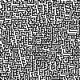
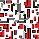
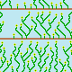

# Wave Function Collapse Image Generation

This project is a desktop application for generating images and videos using the
**Wave Function Collapse (WFC)** algorithm. The application allows users to select
input samples, adjust generation parameters, and produce procedurally generated
outputs.

---

## Image Generation

1. Double-click an input image to select or unselect it.  
   (Only inputs highlighted in green are used for generation.)
2. Adjust the following parameters:
   - Tile size
   - Output size
   - Symmetry
3. Start the generation process to create a new image.

---

## Video Generation

1. Select input images in the same way as for image generation.
2. Configure video parameters:
   - **FPS** – frames per second
   - **Frames per segment** – number of frames between two images
   - **Start appear frame** – delay before the next image appears
   - **Rotation speed** – higher values result in slower rotation
3. Start video generation to produce an animated output.

---

## Output Examples

Below are examples of images generated by the application.

### Maze and City Skyline



### Knot and Organic Patterns




Generated images and videos can be saved to the directory after completion.


---

## Clone Repository

```bash
git clone git@gitlab.fit.cvut.cz:BI-PYT/B251/kostjdan.git
cd kostjdan
```

## Setup
```
python3 -m venv .venv
. .venv/bin/activate
pip install .[dev]
```

## Run
```
python3 app.py
```

